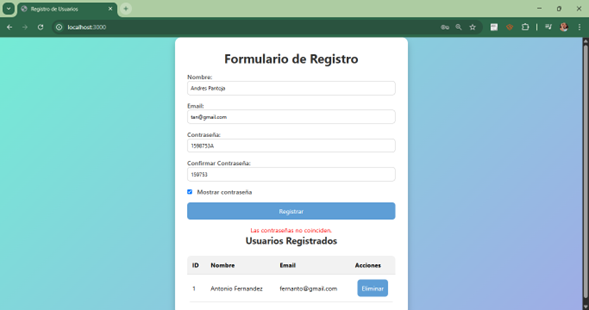
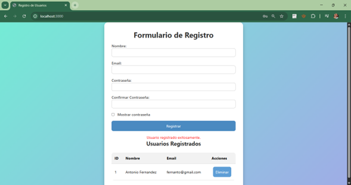
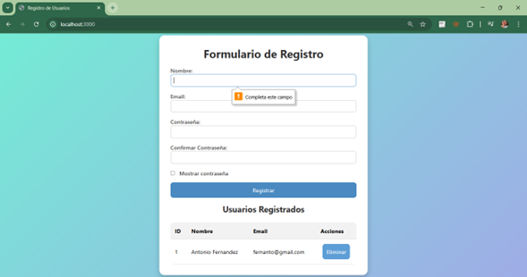
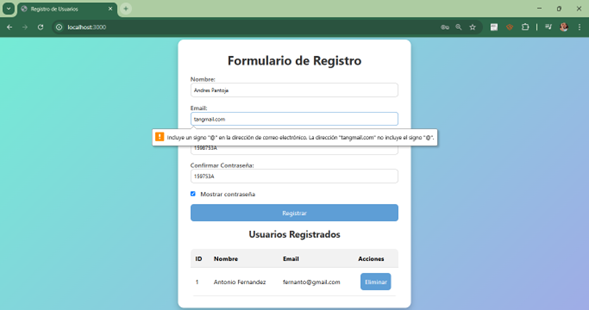
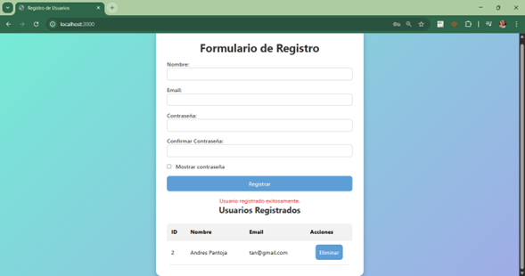
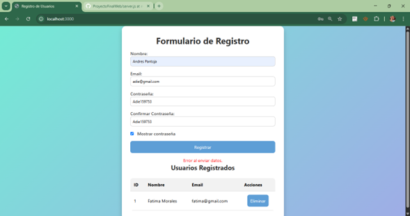

# Registro de Usuarios - Proyecto Final Web

##  Descripción general
Aplicación web que permite registrar usuarios mediante un formulario interactivo, validar los datos ingresados, almacenarlos en una base de datos SQLite y mostrarlos en una tabla con opción para eliminar.

##  Objetivo del proyecto
Crear una solución funcional que conecte el frontend (HTML, CSS, JS) con el backend (Node.js, Express) usando una base de datos ligera (SQLite). Se pone en práctica validación de formularios, rutas HTTP, manejo de bases de datos y despliegue web.

## Tecnologías utilizadas
- HTML5 y CSS3 para el diseño visual
- JavaScript para validación en el navegador
- Node.js con Express para el servidor backend
- SQLite como base de datos
- Render.com para despliegue
- Git y GitHub para control de versiones

## Funcionamiento
1. El usuario llena el formulario con nombre, correo y contraseña.
2. Validaciones en el frontend:
   - Campos obligatorios
   - Correo válido
   - Contraseñas coinciden
3. Se envían los datos al backend con POST `/registro`
4. El backend guarda los datos en `usuarios.db`
5. Los usuarios registrados se muestran en una tabla
6. Los usuarios se pueden eliminar con un botón desde la tabla

## Decisiones técnicas
- **SQLite** tiene facilidad de integración sin instalación adicional.
- **Express.js** manejar ruta REST como `/registro`, `/usuarios`, `/eliminar/:id`.
- Validaciones básicas en el frontend para mejorar experiencia del usuario.
- La contraseña puede mostrarse con un checkbox para facilitar la escritura.

## URL de la app desplegada
(https://proyectofinalweb-9w9s.onrender.com)


## Instrucciones para ejecución local

```bash
# Clonar el repositorio
cd ProyectoFinalWeb (se abre la carpeta donde se encuentra el proyecto)
git init
git remote add origin https://github.com/TU_USUARIO/ProyectoFinalWeb.git
git add . (se agregan todos los archivos que contenga la carpeta en caso de solo querer uno, se especifica el nombre del documento)
git commit -m "Primer commi"
git branch -M main (cambia a la rama main, solo si es necesario se ocupa este paso)
git push -u origin main (sube los cambios)

# Instalar dependencias locales
npm install

# Ejecutar el servidor
npm start

# Abrir en el navegador
http://localhost:3000
```
## 🖼️ Capturas de pantalla
Le faltan caracteres a la contraseña:
 
 
Las contraseñas no coinciden

 
 
Usuario registrado 

 
 
Registro sin poner algún campo
 
 
Que contenga bien la información del correo
  
 
 
Eliminar algún usuario  
 
 
Cuando no se está ejecutando el server.js y no logra enviar los datos correctamente
  


